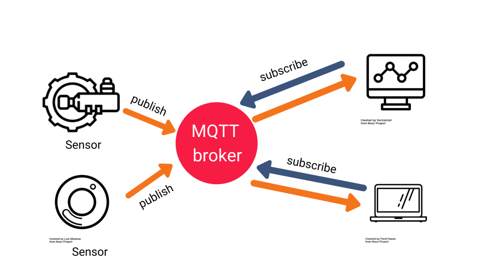

# My bachelor's thesis of Electronic Engineering at University of Bologna
<!--
*** Thanks for checking out the Best-README-Template. If you have a suggestion
*** that would make this better, please fork the NuriCheat and create a pull request
*** or simply open an issue with the tag "enhancement".
*** Thanks again! Now go create something AMAZING! :D
***
***
***
*** To avoid retyping too much info. Do a search and replace for the following:
*** Stikinit, kf-eval, twitter_handle, email, project_title, project_description
-->


<!-- PROJECT SHIELDS -->
<!--
*** I'm using markdown "reference style" links for readability.
*** Reference links are enclosed in brackets [ ] instead of parentheses ( ).
*** See the bottom of this document for the declaration of the reference variables
*** for contributors-url, forks-url, etc. This is an optional, concise syntax you may use.
*** https://www.markdownguide.org/basic-syntax/#reference-style-links
-->
[![Contributors][contributors-shield]][contributors-url]
[![Forks][forks-shield]][forks-url]
[![Stargazers][stars-shield]][stars-url]
[![Issues][issues-shield]][issues-url]
[![MIT License][license-shield]][license-url]
[![GitHub followers][github-shield]][github-url]


<!-- PROJECT LOGO -->
<p align="center">
     
  
<br />
<p align="center">
  <a href="https://github.com/AndreaCastronovo/MQTTandroidApp">
  </a>
  <h1 align="center">MQTTandroidApp</h1>
  <p align="center">
    MQTTandroidApp is android application that monitoring users state and other ambient condition, the acquire data is send at central broker (RaspberryPI3) of the MQTT architecture and then recieved back again an anothers android devices that chose to subscribe at topic.
    <br /> 
    <br />
    <a href="https://github.com/AndreaCastronovo/MQTTandroidApp/blob/main/TesiMQTT%20Andrea%20Castronovo.pdf">In-Depth Document (Italian)</a>
    ·
    <a href="https://github.com/AndreaCastronovo/MQTTandroidApp/issues">Report Bug</a>
    ·
    <a href="https://github.com/AndreaCastronovo/MQTTandroidApp/issues">Request Feature</a>
  </p>
</p>


<!-- TABLE OF CONTENTS -->
<details open="open">
  <summary><h2 style="display: inline-block">Table of Contents</h2></summary>
  <ol>
    <li>
      <a href="#about-the-project">About The Project</a>
      <ul>
        <li><a href="#built-with">Built With</a></li>
      </ul>
    </li>
    <li>
      <a href="#getting-started">Getting Started</a>
      <ul>
        <li><a href="#prerequisites">Prerequisites</a></li>
        <li><a href="#installation">Installation</a></li>
      </ul>
    </li>
    <li><a href="#usage">Usage</a></li>
    <li><a href="#roadmap">Roadmap</a></li>
    <li><a href="#contributing">Contributing</a></li>
    <li><a href="#license">License</a></li>
    <li><a href="#contact">Contact</a></li>
  </ol>
</details>


<!-- ABOUT THE PROJECT -->
## About The Project
MQTTandroidApp is android application that monitoring users state and other ambient condition, the acquired data is send at central broker (RaspberryPI3) of the MQTT architecture and then recieved back again an anothers android devices that chose to subscribe at topic.

### Data Acquisition :
App acquires data like Temperature, Heart Beat, Humidity, Position (Latitude & Longitude), Altitude, Pressure and Steps Count.
There are two type of acquires:
  1. **Embedded Sensors**: this is default mode, app acquires data from embedded sensors so will be shown the weather conditions and ambient data but which sensors are present depends of model device is used to run application.
  2. **SoC ESP32 & BME280**: in case of bluetooth is connected with extern circuit app acquires data from it. The extern circuit is implemented with System on Chip (ESP32) constituted by a multiple sensors to acquire users data because this circuit will be implement in a smart shirt; to send data acquired it's used a bluetooth module (BME280) for display data in the App. 

<p align="center">
    


### MQTT:
 MQTT (Message Queue Telemetry Transport) is a lightweight publish-subscribe messaging standard ISO (ISO / IEC PRF 20922) protocol positioned on top of TCP / IP. It is designed for situations where low impact is required and where bandwidth is limited. The publish-subscribe pattern requires a messaging broker. The broker is responsible for distributing messages to recipient clients.

<p align="center">

</p>

### Data Received and Re-Displayed.

### Built With

* [Visual Studio Code](https://code.visualstudio.com/download) for ssh connection with broker
* [Android Studio](https://developer.android.com/studio)

<!-- GETTING STARTED -->
## Getting Started

To get a local copy up and running follow these simple steps.

### Prerequisites
* Git
* Visual Studio
* Android Studio

### Installation

1. Install Git at [Download Git](https://git-scm.com/download).
2. Clone the repo.
   ```sh
   git clone https://github.com/AndreaCastronovo/MQTTandroidApp
   ```
4. Install the latest version of AndroidStudio.
5. Open the directory with AndroidStudio.
6. Unzip the 7z file in the Resources folder.


<!-- USAGE EXAMPLES -->
## Usage

To use the application:
* Switch AndroidStudio build platform (Android)
* Build and Run


<!-- ROADMAP -->
## Roadmap

See the [open issues](https://github.com/AndreaCastronovo/MQTTandroidApp/issues) for a list of proposed features (and known issues).

### Future developments


<!-- CONTRIBUTING -->
## Contributing

Contributions are what make the open source community such an amazing place to be learn, inspire, and create. Any contributions you make are **greatly appreciated**.

1. Fork the Project
2. Create your Feature Branch (`git checkout -b feature/AmazingFeature`)
3. Commit your Changes (`git commit -m 'Add some AmazingFeature'`)
4. Push to the Branch (`git push origin feature/AmazingFeature`)
5. Open a Pull Request


<!-- LICENSE -->
## License

Distributed under the MIT License. See [`LICENSE`](https://github.com/AndreaCastronovo/MQTTandroidApp/blob/main/LICENSE) for more information.


<!-- CONTACT -->
## Contact

Andrea Castronovo - andrea.castronovo98@gmail.com <br>

Project Link: [https://github.com/AndreaCastronovo/MQTTandroidApp](https://github.com/AndreaCastronovo/MQTTandroidApp)


<!-- MARKDOWN LINKS & IMAGES -->
<!-- https://www.markdownguide.org/basic-syntax/#reference-style-links -->
[contributors-shield]: https://img.shields.io/github/contributors/AndreaCastronovo/MQTTandroidApp.svg?style=for-the-badge
[contributors-url]: https://github.com/AndreaCastronovo/MQTTandroidApp/graphs/contributors
[forks-shield]: https://img.shields.io/github/forks/AndreaCastronovo/MQTTandroidApp.svg?style=for-the-badge
[forks-url]: https://github.com/AndreaCastronovo/MQTTandroidApp/network/members
[stars-shield]: https://img.shields.io/github/stars/AndreaCastronovo/MQTTandroidApp.svg?style=for-the-badge
[stars-url]: https://github.com/AndreaCastronovo/MQTTandroidApp/stargazers
[issues-shield]: https://img.shields.io/github/issues/AndreaCastronovo/MQTTandroidApp.svg?style=for-the-badge
[issues-url]: https://github.com/AndreaCastronovo/MQTTandroidApp/issues
[license-shield]: https://img.shields.io/github/license/AndreaCastronovo/MQTTandroidApp.svg?style=for-the-badge
[license-url]: https://github.com/AndreaCastronovo/MQTTandroidApp/blob/ardice-main/LICENSE
[github-shield]: https://img.shields.io/github/followers/AndreaCastronovo.svg?style=social&label=Follow
[github-url]: https://github.com/AndreaCastronovo
